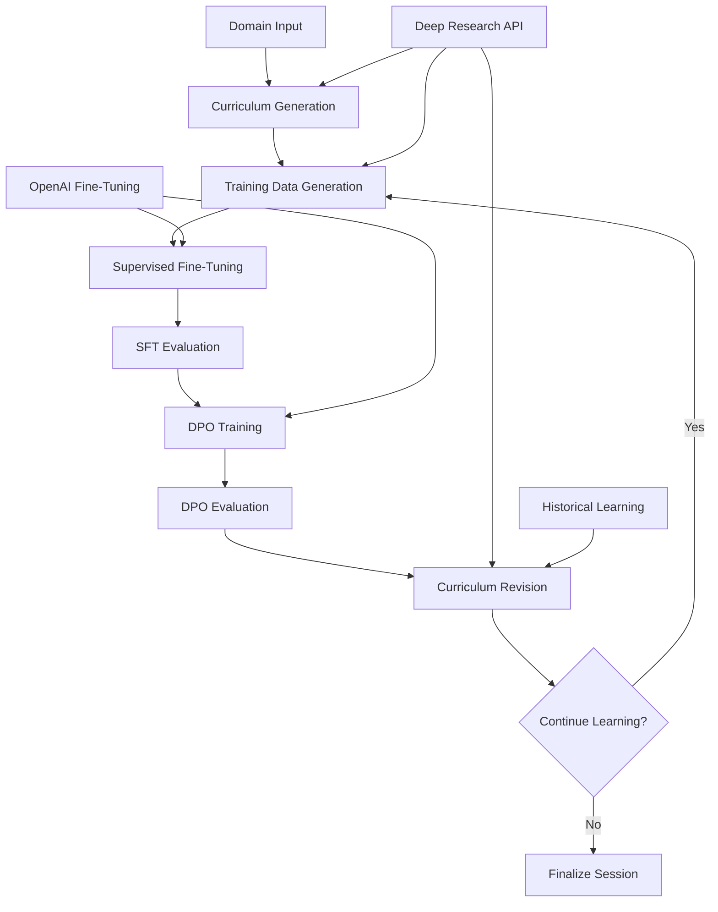

# ALAS: Autonomous Learning Agent System

An intelligent self-learning AI agent system inspired by the [SEAL paper](https://arxiv.org/html/2506.10943v1) that continuously refines itself through iterative curriculum generation, fine-tuning, evaluation, and revision.

## 🌟 Overview

ALAS addresses the challenge of AI models having fixed knowledge cutoffs by creating autonomous agents that can:

- **Generate learning curricula** using OpenAI's Deep Research API
- **Create training data** through intelligent research and question generation
- **Self-improve** via Supervised Fine-Tuning (SFT) and Direct Preference Optimization (DPO)
- **Evaluate performance** and adapt learning strategies
- **Revise curricula** based on performance gaps and mastery
- **Track learning history** across multiple iterations

The system is particularly valuable for rapidly evolving domains where traditional models quickly become outdated.

## 🏗️ Architecture



### Core Components

- **🔬 Deep Research Client**: Leverages OpenAI's o3-deep-research for intelligent curriculum generation
- **📚 Training Data Generator**: Creates diverse Q&A pairs with parallel processing (50 concurrent requests)
- **🔧 Fine-Tuner**: Manages OpenAI fine-tuning jobs with SFT and DPO methods
- **📊 Evaluator**: Comprehensive model evaluation with category-based analysis
- **🎯 DPO Engine**: Improves models using Direct Preference Optimization on incorrect answers
- **🔄 Curriculum Reviser**: Adapts learning paths based on performance with historical context
- **🌐 LangGraph Orchestrator**: Manages the complete workflow with state persistence

## 🚀 Quick Start

### Prerequisites

- Python 3.11+
- OpenAI API key with fine-tuning access
- OpenAI Deep Research API access
- LangSmith account (optional, for monitoring)

### Installation

1. **Clone the repository**
   ```bash
   git clone <repository-url>
   cd ALAS
   ```

2. **Install dependencies**
   ```bash
   pip install -r requirements.txt
   ```

3. **Set up environment variables**
   ```bash
   # Create .env file
   OPENAI_API_KEY=your_openai_api_key_here
   LANGSMITH_API_KEY=your_langsmith_api_key_here
   LANGSMITH_PROJECT=autonomous-learning-agent
   LANGSMITH_TRACING_V2=true
   ```

### Basic Usage

#### Running the Demo

```bash
python demo_autonomous_learning.py
```

This will run a complete 3-iteration learning cycle with cost estimates and progress tracking.

#### Using the Autonomous Agent Programmatically

```python
import asyncio
from src.workflows.autonomous_learning_agent import create_autonomous_learning_agent

async def main():
    # Create agent with 5 iterations max
    agent = create_autonomous_learning_agent(max_iterations=5)
    
    # Run autonomous learning
    result = await agent.run(
        domain="Machine Learning Research", 
        session_id="my_session_001"
    )
    
    print(f"Completed {len(result['iterations'])} iterations")
    print(f"Final model: {result['current_dpo_model_id']}")

asyncio.run(main())
```

#### Using Individual Components

```python
# Generate curriculum
from src.core.deep_research_client import create_deep_research_client

client = create_deep_research_client()
curriculum = await client.generate_curriculum(
    domain="Python Programming",
    learning_goals=["Master fundamentals", "Build projects"]
)

# Generate training data
from src.core.training_data_generator import create_training_data_generator

generator = create_training_data_generator()
training_data = await generator.generate_curriculum_training_data(curriculum)

# Fine-tune model
from src.core.fine_tuner import create_fine_tuner

fine_tuner = create_fine_tuner()
result = fine_tuner.fine_tune_from_file(
    training_file_path="training_data.jsonl",
    model="gpt-4.1-2025-04-14"
)
```

## 🎮 LangGraph Studio Integration

ALAS includes full LangGraph Studio support for visual workflow management.

### Setup

1. **Install LangGraph CLI**
   ```bash
   pip install -U "langgraph-cli[inmem]"
   ```

2. **Start LangGraph Studio**
   ```bash
   langgraph dev
   ```

3. **Open in browser**
   ```
   http://localhost:2024
   ```

The workflow will be available as the "agent" graph with full visual debugging and state inspection.

## 📊 Learning Process

### Iteration Workflow

Each learning iteration follows this pattern:

1. **📚 Curriculum Generation**: Create or revise learning topics based on domain and performance
2. **📝 Training Data Creation**: Generate diverse Q&A pairs using Deep Research API
3. **🔧 Supervised Fine-Tuning**: Train model on correct examples
4. **📊 SFT Evaluation**: Test model performance and identify weak areas
5. **🎯 DPO Training**: Improve model using preference optimization on incorrect answers
6. **📈 DPO Evaluation**: Re-evaluate improved model
7. **🔄 Curriculum Revision**: Update learning plan based on results

### Historical Learning Tracking

ALAS maintains a `learned_topics.json` file that tracks:
- All topics mastered across iterations
- Accuracy scores and improvement over time
- Learning progression and iteration metadata

This enables the system to:
- Avoid repeating mastered topics
- Build advanced curricula on solid foundations
- Provide comprehensive learning context

### Performance Analysis

The evaluation system provides detailed analysis:

```json
{
  "overall_accuracy": 0.85,
  "category_performance": {
    "Factual Recall": {"accuracy": 0.9},
    "Conceptual Understanding": {"accuracy": 0.8},
    "Application": {"accuracy": 0.85}
  },
  "topic_results": [
    {
      "topic_name": "Python Basics",
      "accuracy": 0.95,
      "mastered": true
    }
  ]
}
```

## 💰 Cost Management

### Estimated Costs (per iteration)

- **Curriculum Generation**: ~$0.10
- **Training Data Generation**: ~$0.50
- **Supervised Fine-Tuning**: ~$20-50
- **Model Evaluation**: ~$0.20
- **DPO Fine-Tuning**: ~$15-30
- **Curriculum Revision**: ~$0.10

**Total per iteration**: ~$35-80  
**3-iteration cycle**: ~$110-240

### Cost Optimization Features

- Parallel processing for faster execution
- Configurable iteration limits
- Smart curriculum revision to avoid redundant learning
- Efficient evaluation with targeted question generation

## 🔧 Configuration

### Settings

Key configuration options in `src/config/settings.py`:

```python
class LearningSettings:
    max_iterations: int = 5
    topics_per_iteration: int = 10
    questions_per_topic: int = 10
    evaluation_threshold: float = 0.7
    mastery_threshold: float = 0.9
    max_concurrent_requests: int = 50
```

### Model Selection

Supported models for fine-tuning:
- `gpt-4.1-2025-04-14` (recommended)
- `gpt-4.1-mini-2025-04-14` (cost-effective)
- `gpt-4.1-nano-2025-04-14` (fast iterations)

## 📁 Project Structure

```
ALAS/
├── src/
│   ├── core/                      # Core learning components
│   │   ├── deep_research_client.py    # OpenAI Deep Research integration
│   │   ├── training_data_generator.py # Question & answer generation
│   │   ├── fine_tuner.py              # OpenAI fine-tuning wrapper
│   │   ├── evaluator.py               # Model evaluation system
│   │   ├── dpo_improvement.py         # DPO training implementation
│   │   └── curriculum_revision.py     # Performance-based curriculum updates
│   ├── workflows/                 # LangGraph workflows
│   │   └── autonomous_learning_agent.py # Main orchestration workflow
│   └── config/                    # Configuration
│       └── settings.py
├── data/                          # Generated data storage
│   ├── curricula/                 # Learning curricula
│   ├── training_data/             # Generated Q&A pairs
│   ├── evaluations/               # Model evaluation results
│   └── sessions/                  # Session summaries
├── demo_autonomous_learning.py    # Demo script
├── langgraph.json                 # LangGraph Studio configuration
└── learned_topics.json            # Historical learning tracker
```

## 🧪 Testing

Run individual component tests:

```bash
# Test Deep Research API
python test_deep_research.py

# Test curriculum revision
python test_curriculum_revision.py

# Test DPO improvement
python test_dpo_improvement.py

# Test evaluation system
python test_evaluation.py
```

## 🤝 Contributing

1. Fork the repository
2. Create a feature branch (`git checkout -b feature/amazing-feature`)
3. Commit your changes (`git commit -m 'Add amazing feature'`)
4. Push to the branch (`git push origin feature/amazing-feature`)
5. Open a Pull Request

## 📄 License

This project is licensed under the MIT License - see the [LICENSE](LICENSE) file for details.

## 🙏 Acknowledgments

- Inspired by the [SEAL paper](https://arxiv.org/html/2506.10943v1) on self-adapting language models
- Built with [OpenAI's APIs](https://platform.openai.com/) and [LangGraph](https://langchain-ai.github.io/langgraph/)
- Uses [LangSmith](https://docs.smith.langchain.com/) for monitoring and observability

## 📚 Further Reading

- [SEAL Paper: Self-Adapting Language Models](https://arxiv.org/html/2506.10943v1)
- [OpenAI Fine-Tuning Guide](https://platform.openai.com/docs/guides/fine-tuning)
- [Direct Preference Optimization](https://platform.openai.com/docs/guides/direct-preference-optimization)
- [LangGraph Documentation](https://langchain-ai.github.io/langgraph/)

---

**Built with ❤️ for autonomous AI learning** 